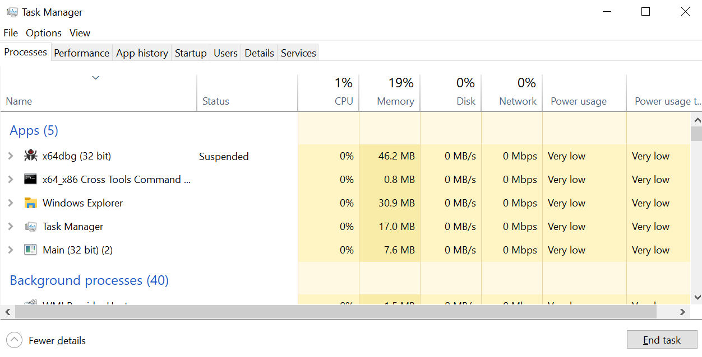
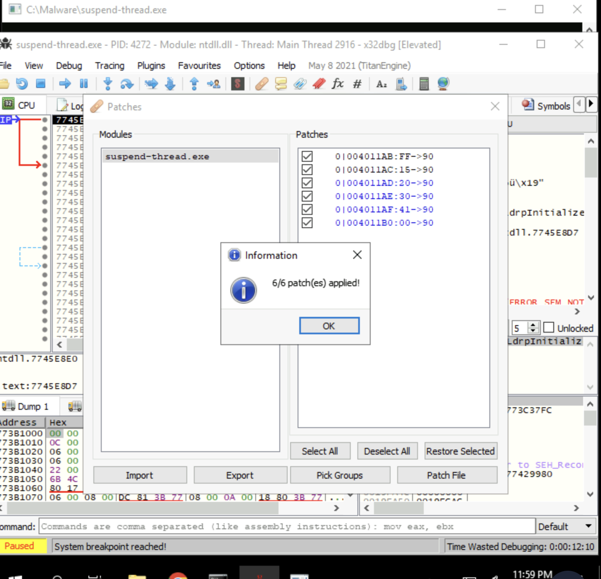
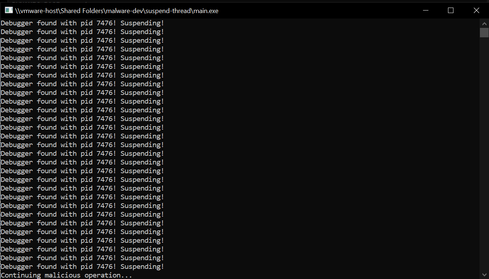

# THM_Anti-Reverse_Engineering
## TryHackMe Anti-Reverse Engineering Box

### Learning Objectives
- Understand why malware authors use anti-reverse engineering techniques.
- Explore different anti-reverse engineering techniques.
- Learn how to circumvent anti-reverse engineering using various tools.
- Implement anti-reverse engineering techniques by reading the source code.

---

### What I Did and Learned

#### Anti-Debugging Overview
- Malware authors employ anti-debugging measures.
- They check for the presence of debuggers using Windows API functions (e.g., `IsDebuggerPresent`).
- Malware may tamper with debugger registers or alter code execution to prevent the debugger from functioning correctly.
- Utilization of self-modifying code.

#### Anti-Debugging Using Suspend Thread
- Windows API functions can pause the execution of a thread in a process.
- Malware may use this technique to halt the execution of the debugger entirely.
- I ran an example program demonstrating this technique, which suspends the debug process in **x64dbg**:

**Solution**: Patch the `SuspendThread` function so that the debugger won't be suspended.

**Steps**:
1. Open **x64dbg** and load the example malware file.
2. Press **F9** to jump to the execution EntryPoint.
3. In the intermodular calls, search for `SuspendThread` and select the `SuspendThread` entry.
4. For the part of the code that calls the `SuspendThread` API, fill it with NOPs. Set memory from `0004011AB` to `00401B0` to `90` hex (No Operation).
5. Now, when attempting to continue execution of the malware, it prints "Debugger found...! Suspending" while still finding the debugger, effectively skipping the part of the malware execution that suspends the debugger.
6. This is a temporary fix; we need to export and then import our patch for future use.
7. Repeat the patch steps, but before rerunning, view the patch file and save it.
8. Re-debug the malware and import the patch.

9. As observed, without going through the entire patching process, we have successfully patched the malware:

